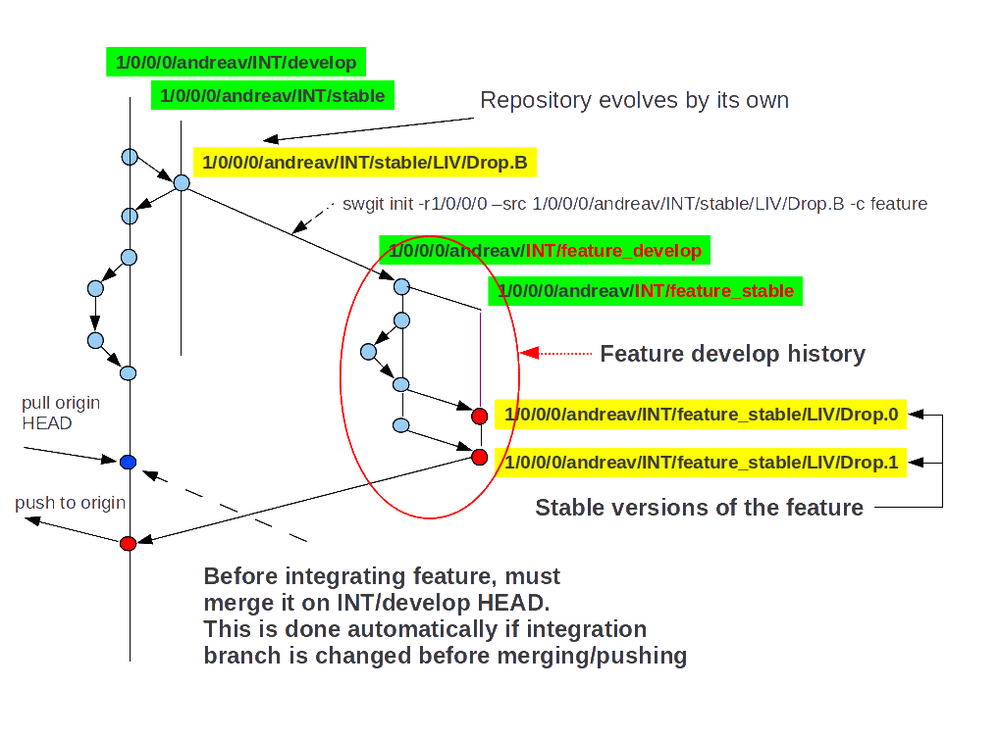

.. Copyright (C) 2012 Andrea Valle
   
   This file is part of swgit.
   
   swgit is free software: you can redistribute it and/or modify
   it under the terms of the GNU General Public License as published by
   the Free Software Foundation, either version 3 of the License, or
   (at your option) any later version.
   
   swgit is distributed in the hope that it will be useful,
   but WITHOUT ANY WARRANTY; without even the implied warranty of
   MERCHANTABILITY or FITNESS FOR A PARTICULAR PURPOSE.  See the
   GNU General Public License for more details.
   
   You should have received a copy of the GNU General Public License
   along with swgit.  If not, see <http://www.gnu.org/licenses/>.

.. include:: globals.rst

######################
Wokflow - Team Feature
######################

Scenario:

  A sub-team is responsible for developing a big feature.

Solutions:

  * :ref:`lbl_wf_team_feature_shared_topic_branch`

  * :ref:`lbl_wf_team_feature_develop_stable_pair`

.. _lbl_wf_team_feature_shared_topic_branch:

Shared topic branch
-------------------

This solution is best suited for little/medium features.

Many developers will share the same FTR branch.

This scenario heavily leverage :doc:`intbr`

Create a plain topic branch on clone::

  swgit branch --create feature

Now Integrator can choose two solutions:

  1. This clone repository will become temporary 'origin' repository: 

      .. figure:: images/static/swgit_shared_branch_1.gif
        :scale: 65 %
        :align: center

     * Every member will clone from this repository specifying 
       *FTR/feature* branch with -b option::

         swgit clone /path/to/clone/with/sharedbranch -b <shared_branch>

     * Every developer will merge and push on *FTR/feature* branch.
      
     * When feature is finished, inside temporary 'origin' repository.
       someone will merge this brach on INT/develop.

     .. note:
        If you choose this method, remember moving away HEAD from *FTR/feature*
        otherwise every pull from cloned repsository will fail with git error:
        (refusing to update checked out branch)::

          swgit branch -s <anywhere>

  2. Push this branch on 'origin' and let other users update their repositories:

      .. figure:: images/static/swgit_shared_branch_2.gif
        :scale: 65 %
        :align: center

     * Set *FTR/feature* as default integartion branch::
       
         swgit branch --set-integration-br 1/0/0/0/andreav/FTR/feature
       
     * Push it to 'origin'::
       
         swgit push

       .. note::
         This branch will also automatically be tracked, you can verify it by::
         
           swgit branch swgit branch --list-tracked

     * Every developer, inside his/her repository, will pull, thus downloading 
       this new *FTR/feature* branch.
       
         swgit pull

     * Every developer will set *FTR/feature* as default integartion branch::

         swgit branch --set-integration-br 1/0/0/0/andreav/FTR/feature

     * When feature is finished from any repository, someone will:
       
        * restore *INT/develop* as integartion branch::

           swgit branch --set-integration-br 1/0/0/0/andreav/INT/develop

        * tag *1/0/0/0/andreav/FTR/feature* feature with DEV label::

           swgit tag dev -m "ready to merge feature inside main stream"

        * merge *FTR/feature* on just restored integartion branch::

           swgit merge -I
           swgit push

          or simply::

           swgit push -I

          This will pull all changes during feature development happened on 
          *INT/develop* letting user properly integrate just finished feature
          into main stream.

.. _lbl_wf_team_feature_develop_stable_pair:

New develop/stable pair
-----------------------

This solution is best suited for big features.

| Its added value is providing sub-team with a separate environment.
| There, team can:

    * stabilize successive feature versions

    * run validation tests

This is accompished by this command (on origin):

  ::

    swgit init -r 1.0.0.0 --create feature
  
  thus obtaining branches like::
  
    1/0/0/0/andreav/INT/feature_develop
    1/0/0/0/andreav/INT/feature_stable

Every developer can:

  1. clone specifying -b 1/0/0/0/andreav/INT/feature_develop
     like any other *INT* branch::

         swgit clone /path/to/clone -b 1/0/0/0/andreav/INT/feature_develop

  2. If he/she prefers keeping current clone repository, just:

      * pull to download new branch::

         swgit  pull

      * set it as integartiorn branch:

         swgit  branch --set-integration-br 1/0/0/0/andreav/INT/feature_develop

  3. Team from now on will work around *1/0/0/0/andreav/INT/feature_develop feature*,
     anyone owning an :term:`integrator repository` can stabilize feature on 
     *1/0/0/0/andreav/INT/feature_stable*

  
  4. When feature is finished from any repository, someone will:
       
      * restore *INT/develop* as integartion branch::

         swgit branch --set-integration-br 1/0/0/0/andreav/INT/develop

      * merge last LIV label::

         swgit branch -i          # swith on integartion branch
         swgit merge  1/0/0/0/andreav/INT/feature_stable/LIV/Drop.3
         swgit push

